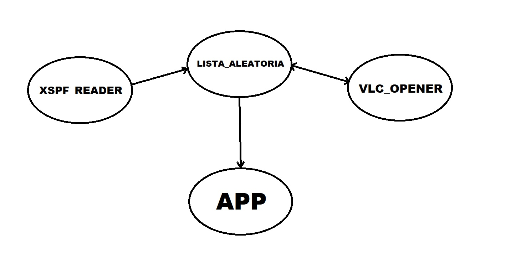

# Desteveco Spotify
## Indice
1. [Introducción](#introducción)
2. [Clockify](#clockify)
3. [Diagrama De Componentes](#diagrama-de-componentes)
4. [Arquitectura De La Aplicación](#arquitectura-de-la-aplicación)
5. [Tecnologías Utilizadas](#tecnologuías-utilizadas)
6. [Instrucciones De Instalación](#instrucciones-de-instalación)
7. [Instrucciones De Uso](#instrucciones-de-uso)
8. [Dificultades Y Mejoras](#dificultades-y-mejoras)
9. [Menciones Honorificas](#menciones-honorificas)

rthfbg

## Introducción
Breve introducción al proyecto.

### Diagrama de Componentes

### Descripción del proyecto
Pequeña descripción de lo que hace el proyecto.

### Atribución al profesor
Reconocimiento al profesor o cualquier otra atribución necesaria.

## Manual
Pasos para la instalación y uso del proyecto.

### Pre-requisitos
- Python 3.12
- Git 2.43
- Visual Studio Code

Asegúrate de tener VLC instalado en tu sistema.

### Instalación
Pasos para instalar el proyecto.

### Uso
Instrucciones sobre cómo utilizar el proyecto.

## Metodología
Detalles sobre la metodología utilizada.

### Ramas utilizadas
Número y nombre de las ramas usadas.

### Descripción de cada rama
Explicación de lo que se hace en cada rama.

## Descripción Técnica
Detalles técnicos del proyecto.

### Planteamiento de la aplicación
Explicación del enfoque general de la aplicación.

### Arquitectura de la aplicación
Diagrama de componentes o arquitectura de la aplicación.

### Componentes y responsabilidades
Descripción de los componentes principales y sus responsabilidades.

### Esquema de datos
Ejemplo del esquema de datos utilizado en el proyecto.

## Pruebas
Ejemplo de ejecución correcta del programa.

## Coverage
Resultados del test de cobertura.

## Clockify (Opcional)
Detalle del tiempo invertido en el proyecto.

## Conclusiones
- Posibles mejoras.
- Dificultades encontradas.
